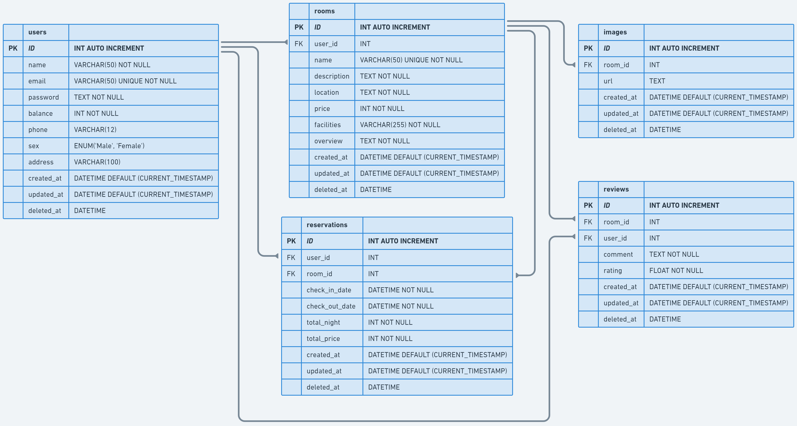

# Airbnb App Project

## 💻 About The Project

Airbnb is a marketplace used to book lodging and homestays.

## ✨ App Features
:white_check_mark: Users can operate **create**, **read**, **update** and **delete** on **user's** data. Registered users also can **login** to app.\
:white_check_mark: Users can view all list homestays on the app and can view homestay detail.\
:white_check_mark: Users can **booking** homestay (homestay reservation).\
:white_check_mark: Besides being able to do book a homestay, users also can be the **hosting**. Hosting is a service where the user rents out his house. (Users who are hosting can only update and delete data in their own houses. Cannot edit other user's data).\
:white_check_mark: Users can add ratings and comment to booked homestay.

## 🛠 &nbsp;Build App & Database


## 🗃️ ERD



## OpenAPI Documentation

If you want to consume open api <a href="https://app.swaggerhub.com/apis-docs/JURRASIC_1/ALTA-Airbnb-API/1.0"> here </a>

## Run Locally

Clone the project

```bash
https://github.com/GP3-group1/ALTA-Airbnb-BE.git
```

Go to the project directory

```bash
cd ALTA-Airbnb-BE
```
## 👥 Credit

[](https://github.com/Velocyes)
[](https://github.com/kharismajanuar)

<h3>
<p align="center">:copyright: 2023  </p>
</h3>

<p align="right" style="padding: 5px; border-radius: 100%; background-color: red; font-size: 2rem;">
  <b><a href="#Immersive-Dashboard">BACK TO TOP</a></b>
</p>
